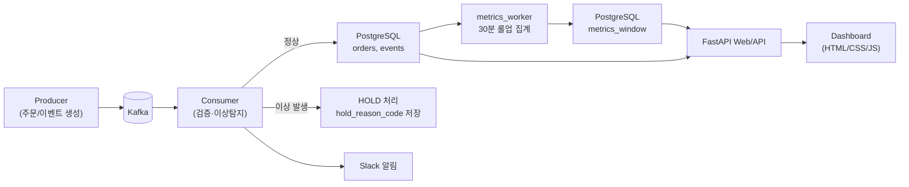

# Fulfillment Pipeline (통합 풀필먼트 관제 & 이상감지 대시보드)

여러 판매 채널에서 들어오는 **주문/이벤트를 Kafka로 통합 수집**하고,  
Consumer에서 **검증·이상탐지 → HOLD 격리**, **Slack 알림**, **PostgreSQL 저장/집계(metrics_window)** 후  
웹 대시보드에서 **현황 모니터링 + 운영 조치(ACK/RESOLVE/RETRY)**까지 연결하는 프로젝트입니다.
---

## 목차
- [프로젝트 개요](#프로젝트-개요)
- [핵심 기능](#핵심-기능)
- [폴더 구조](#폴더-구조)
- [아키텍처](#아키텍처)
- [빠른 시작](#빠른-시작)
- [환경변수(.env)](#환경변수env)
- [대시보드 화면](#대시보드-화면)
- [주요 데이터(테이블) 개요](#주요-데이터테이블-개요)
- [API 개요](#api-개요)
- [트러블슈팅](#트러블슈팅)

---

## 프로젝트 개요

### 문제의식
- 주문이 여러 채널(스토어/마켓 등)로 분산되면 운영 측면에서 **통합 모니터링/대응**이 어렵습니다.
- 특히 재고 부족, 주소 누락, 이상 거래 같은 이슈는 **빠른 격리(HOLD)와 알림**이 필요합니다.

### 목표
- **주문/이벤트 통합 수집 → 검증/이상탐지 → HOLD 격리 → 알림 → 운영 조치 → 집계/시각화**까지
- 하나의 파이프라인으로 연결된 “운영 관제 시스템” 구축

---

## 핵심 기능

### 1) Kafka 기반 이벤트 파이프라인
- Producer가 주문/이벤트 메시지를 Kafka 토픽으로 발행
- Consumer가 메시지를 읽어 **원본 저장 + 도메인 테이블 반영**

### 2) 검증/이상탐지 → HOLD 격리
- 주문 데이터 누락, 재고 부족, 특정 유저/상품의 비정상 패턴 등을 감지하면 주문을 **HOLD**로 전환
- HOLD 사유 코드를 저장하고, 운영자에게 알림

**HOLD 사유 코드 예시**
- `FUL-VALID` : 주문 정보 누락(주소/유저ID 등)
- `FUL-INV` : 재고 부족
- `FUL-FRAUD-USER` : 유저 기준 이상거래
- `FUL-FRAUD-PROD` : 상품 기준 이상거래

### 3) Slack 알림
- 이상 탐지 시 Slack(Webhook)으로 알림 전송 (운영자가 즉시 대응)

### 4) 30분 롤업 집계(metrics_window)
- 실시간 테이블(orders/events/alerts)을 기반으로
- **30분 단위로 집계 데이터를 저장**해서 차트/요약 KPI를 빠르게 조회

### 5) Web 대시보드
- Dashboard: KPI + 시계열 차트 + 최근 데이터
- Orders: 주문 리스트/필터/상세
- Events: 이벤트 리스트/필터
- Alerts: 알림 리스트 + ACK/RESOLVE/RETRY

---

## 폴더 구조

```text
.
├─ backend/
│  └─ app/
│     ├─ sql/
│     │  ├─ queries.sql
│     │  └─ rollup_metrics_window.sql
│     ├─ main.py
│     ├─ metrics_worker.py
│     ├─ schemas.py
│     ├─ store.py
│     └─ __init__.py
├─ init_sql/
├─ src/
│  ├─ consumer/
│  │  ├─ anomaly_consumer.py
│  │  ├─ consumer.py
│  │  ├─ risk_consumer.py
│  │  └─ __init__.py
│  ├─ producer/
│  │  ├─ data_factory.py
│  │  ├─ producer.py
│  │  └─ __init__.py
│  ├─ config.py
│  └─ __init__.py
├─ web/
│  ├─ static/
│  │  ├─ css/custom.css
│  │  └─ js/app.js
│  └─ templates/
│     ├─ base.html
│     ├─ dashboard.html
│     ├─ orders.html
│     ├─ order_detail.html
│     ├─ events.html
│     └─ alerts.html
├─ docker-compose.yml
├─ Dockerfile
├─ requirements.txt
├─ .env.example
└─ .gitignore
```

---

## 빠른 시작

> 아래는 **Docker Compose 기준**입니다.

### 1) 레포 클론
```bash
git clone https://github.com/kangminjong/fulfillment-pipeline.git
cd fulfillment-pipeline
```

### 2) 환경변수 파일 준비
```bash
cp .env.example .env
```

### 3) 컨테이너 실행
```bash
docker compose up -d --build
docker compose logs -f
```

### 4) 접속
- 대시보드(예시): `http://localhost:8000`  
  ※ 실제 포트는 `docker-compose.yml` 포트 매핑을 기준으로 확인하세요.

---

## 아키텍처



---

## 대시보드 화면

- **Dashboard**
  - KPI(주문/이벤트/알림/지연) 요약
  - 시계열 차트(12h/24h/7d/30d 프리셋)
  - 최근 주문/최근 알림 테이블
- **Orders**
  - 상태/단계/검색 필터
  - 주문 상세: 현재 상태, 관련 알림, 최근 이벤트
- **Events**
  - 주문번호/이벤트타입/오류만 보기 등 필터
- **Alerts**
  - 상태(OPEN/ACK/RESOLVED/RETRY_REQUESTED) / 종류(EVENT/HOLD) 필터
  - 운영 액션: ACK / RESOLVE / RETRY

---

## 주요 데이터(테이블) 개요

> 실제 컬럼은 `init_sql/` 및 `backend/app/sql/`을 기준으로 확인하세요.

- `orders_raw` : Kafka 수신 원본(JSON) 저장 (복구/추적용)
- `orders` : 주문 도메인 테이블 (current_status, hold_reason_code 등)
- `events` : 주문 이벤트 로그 (event_type, occurred_at 등)
- `alerts` : 운영 알림(OPEN/ACK/RESOLVED/RETRY 등)
- `metrics_window` : 30분 롤업 집계 저장소 (대시보드 차트/KPI용)

---

## API 개요

> UI는 HTML 템플릿 + JS(fetch)로 아래 API들을 호출하는 형태입니다.

### 페이지
- `/` : Dashboard
- `/orders` : 주문 목록
- `/orders/{id}` : 주문 상세
- `/events` : 이벤트 목록
- `/alerts` : 알림 목록

---

## 환경변수(.env)

`.env.example`를 복사해서 `.env`를 만들고 값만 채우면 됩니다.

예시(프로젝트 설정에 맞게 조정):
```dotenv
# PostgreSQL
DB_HOST=localhost
DB_PORT=5432
DB_NAME=fulfillment
DB_USER=user
DB_PASSWORD=user

# Kafka
KAFKA_BOOTSTRAP_SERVERS=localhost:9092
KAFKA_TOPIC=event
KAFKA_GROUP_ID=risk-management-group

# Slack
SLACK_WEBHOOK_URL=https://hooks.slack.com/services/XXXX/XXXX/XXXX

# App
APP_TZ=Asia/Seoul
```
---

## 트러블슈팅

### 1) 데이터가 “계속 쌓이는” 것처럼 보여요
- `metrics_worker`가 주기적으로 롤업/백필을 돌리면 `metrics_window`가 계속 업데이트될 수 있습니다.
- 로컬 프로세스/컨테이너가 떠 있는지 확인:
```bash
ps aux | egrep "metrics_worker|rollup|uvicorn|consumer|producer"
docker compose ps
docker compose logs -f
```

### 2) DB 접속이 안 돼요
- `.env`의 `DB_HOST/PORT`가 컨테이너/로컬 상황과 맞는지 확인하세요.
- 컨테이너 내부에서 backend가 DB로 접근한다면 `DB_HOST=postgres`처럼 **서비스명**으로 잡아야 할 수 있습니다.

### 3) Kafka 연결 오류
- bootstrap server가 `localhost:9092`인지, 컨테이너 내부 접근인지 확인하세요.
- 컨테이너 내부면 `kafka:9092`처럼 **서비스명**으로 접근해야 할 수 있습니다.

---

## 팀 메모
- 이 프로젝트는 “실시간 운영 관제”를 목표로 합니다.
- 단순 수집에서 끝나지 않고, **이상 주문 격리(HOLD) + 알림 + 운영 조치 + 지표 집계**까지 한 흐름으로 연결하는 데 초점을 맞췄습니다.
